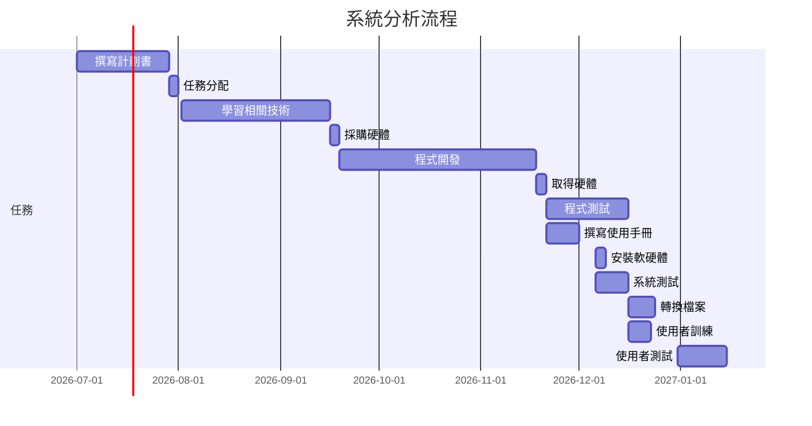
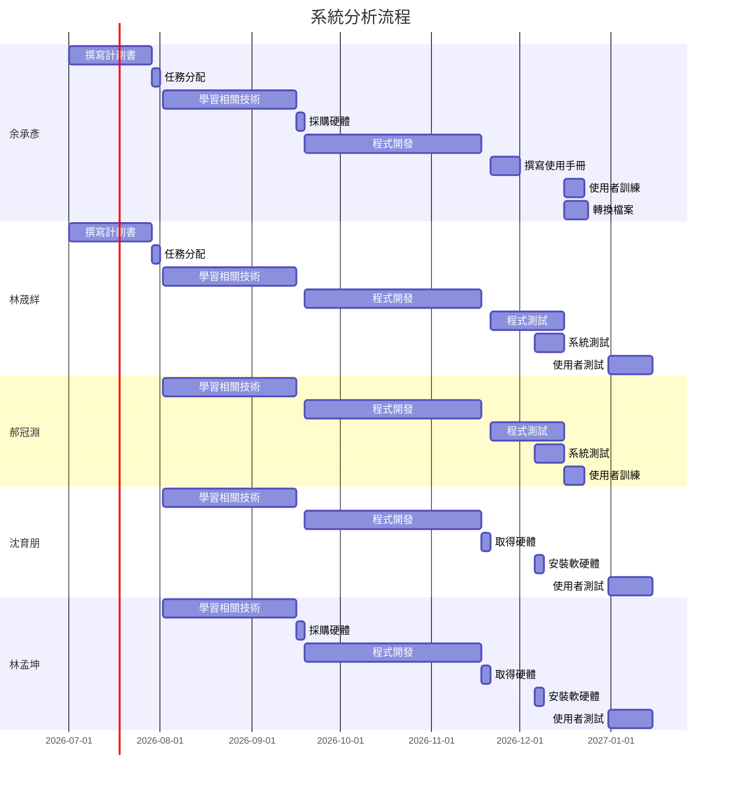

# System_First10-
# 專題題目: 科技碳淨零
### 內容:
###### 
  由於台灣有炎熱的天氣，許多人在家都會開啟冷氣來消暑，不過，不少使用者也擔心電費會因此而爆表，所以不敢長時間開啟，但也有人覺得變頻空調開開關關的反而會更加耗電，大部分的使用者使用變頻空調的習慣都不一樣，有的人認為吹整天比較省電；有的認為若要出門一段時間的話，關掉反而比較省電，但是這沒有正確答案，都會因外在環境因素產生不一樣的答案 。
  對此，本小組希望能夠透過紅外線熱像儀來偵測房間內的熱外洩，並從熱像儀中提出熱像資料，再使用AI人工智慧應用來分析影像資料來量化環境這個不確定因素，使「到底變頻空調開一整天跟開開關關哪個更省？」這個議題得到最適合的解答。 

---

### 組長: 余承彥
#### 組員: 林荿絴、郝冠淵、沈育朋、林孟坤

---
## 組員任務分配 : 
| 姓名 | 負責任務 |
| ---- | ---- |
| 余承彥 | 撰寫計劃書、 學習相關技術、任務分配、程式開發、撰寫使用手冊、使用者訓練、轉換檔案 |
| 林荿絴 | 撰寫計劃書、 學習相關技術、任務分配、程式開發、程式測試、系統測試、使用者測試 |
| 郝冠淵| 學習相關技術、程式開發、程式測試、系統測試、使用者訓練 |
| 沈育朋| 學習相關技術、程式開發、取得硬體、安裝軟硬體、使用者測試 |
| 林孟坤| 學習相關技術、採購硬體、取得硬體、程式開發、安裝軟硬體、使用者測試 |
---
## 科技碳淨零 1024
|序 | 任務 | 需時(天) |  前置任務  |
|:--:|:---:|:-----:|:-----:|
| 1  | 撰寫企畫書 | 28 | - |
| 2  | 任務分配 |3 | 1 |   
| 3  | 學習相關技術 | 45 | 2 |
| 4  | 採購硬體 | 3 | 3 |
| 5  | 程式開發 | 60 | 4 |
| 6  | 取得硬體 | 3 | 5|
| 7  | 程式測試 | 25 | 6 |
| 8  | 撰寫使用手冊 | 10 | 6 |
| 9  | 安裝軟硬體 | 3 | 7,8,9 |
| 10 | 系統測試 | 10 | 9 |
| 11 | 轉換檔案 | 8 | 10 |
| 12 | 使用者訓練 | 3 | 10 |
| 13 | 使用者測試 | 15 | 11 |

---

## 甘特圖:

